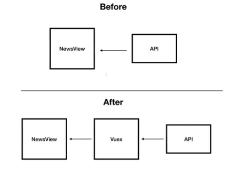
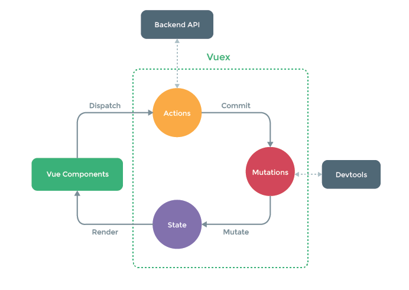
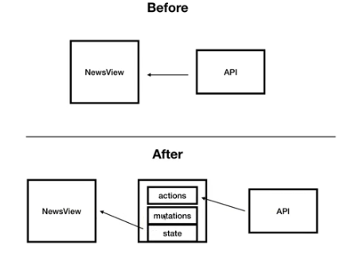

vuex란?



- Vue.js 프레임워크에 사용할 수 있는 상태 관리 도구
- 이때, 상태라는 것은 여러 컴포넌트 간에 공유되는 데이터 속성이다.

<br>

vuex를 사용하는 이유

- 예를 들어, NewsView는 users라고 하는 데이터 속성을 다른 컴포넌트와 공유되고 있지 않다.
- 한 개의 컴포넌트에서 들고 있는 데이터를 다른 컴포넌트에서 조작해야 할 때 Vuex를 사용한다.

<br>

vuex의 구조





- dispatch 라는 api를 이용해서 actions 호출
- actions는 백엔드 api를 들고 와서 mutations에 넘겨주기 위한 속성
- 받아온 데이터를 mutations를 통해서 state에 넣어줌
- => actions는 API를 호출하기만 하고, 그 데이터를 꺼내와서 state에 담기 위해 mutations를 별도로 호출해야 한다.

<br>

vuex 설치

- npm i vuex@3.6.2
- 3.6.2로 버전 명시함

<br>

기존의 NewsView 수정

- /src/store/index.js

  ```javascript
  import Vue from 'vue';
  import Vuex from 'vuex';
  import { fetchNewsList } from '../api/index.js';
  
  Vue.use(Vuex);
  
  //Vuex: 상태 관리 도구
  //이때, 상태라는 것은 여러 컴포넌트 간에 공유되는 데이터 속성이다.
  
  //예를 들어, NewsView는 users라고 하는 데이터 속성을
  //다른 컴포넌트와 공윻고 있지 않다.
  
  //한 개의 컴포넌트에서 들고 있는 데이터를 다른 컴포넌트에서 조작해야 할 때
  //Vuex를 사용한다.
  export const store = new Vuex.Store({
      state: {
          news: []
      },
      mutations: {
          SET_NEWS(state, news) {
              state.news = news;
          }
      },
      actions: {
          //context: mutations에 접근할 수 있는 인자
          FETCH_NEWS(context) {
              fetchNewsList()
                  .then(response => {
                      console.log(response.data);
                      //commit 기능을 통해 mutations에 데이터를 넘길 수 있음
                      //커밋하는 순간, SET_NEWS 실행
                      context.commit('SET_NEWS', response.data);
                  })
                  .catch(error => {
                      console.log(error);
                  })
          }
      }
  });
  ```

- /src/main.js

  ```javascript
  import Vue from 'vue'
  import App from './App.vue'
  import { router } from './routes/index.js';
  import { store } from './store/index.js'
  
  Vue.config.productionTip = false
  
  new Vue({
    render: h => h(App),
    router,
    store,
  }).$mount('#app')
  ```

- /src/views/NewsView.vue

  ```vue
  <template>
    <div>
      <div v-for="n in this.$store.state.news">{{ n.title }}</div>
    </div>
  </template>
  
  <script>
  import { fetchNewsList } from '../api/index.js';
  
  export default {
    created() {
      this.$store.dispatch('FETCH_NEWS');
    },
  }
  </script>
  
  <style>
  
  </style>
  ```